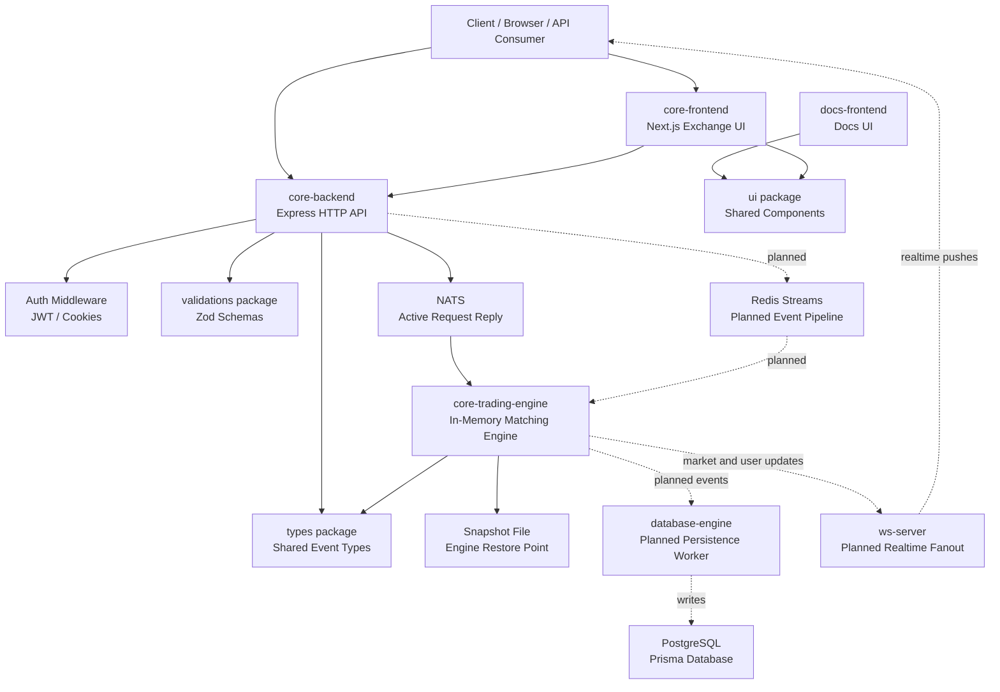
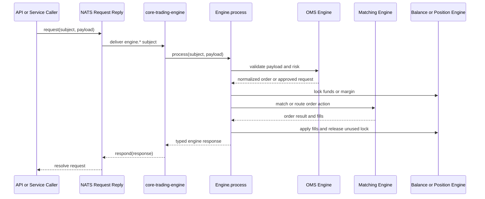
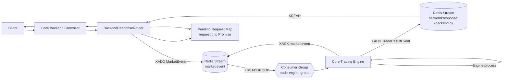
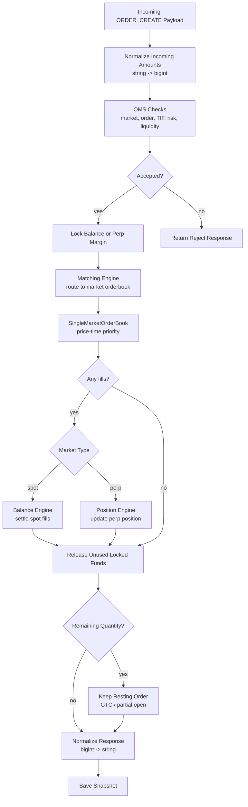
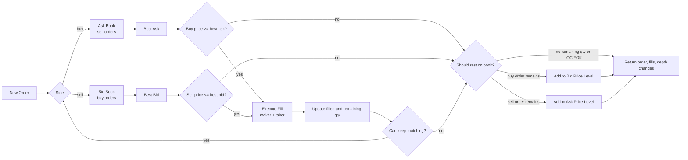
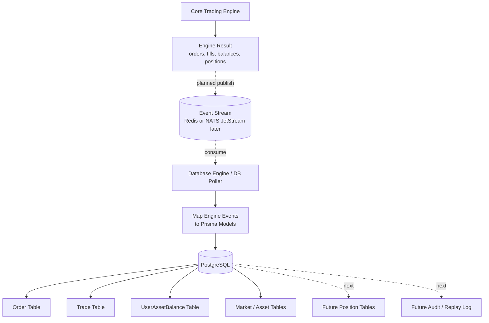
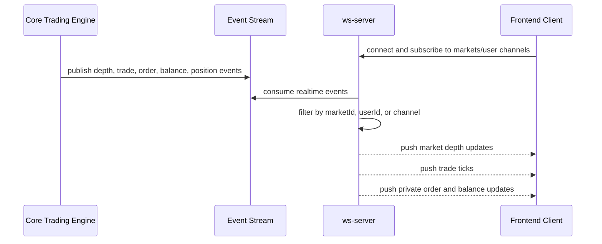
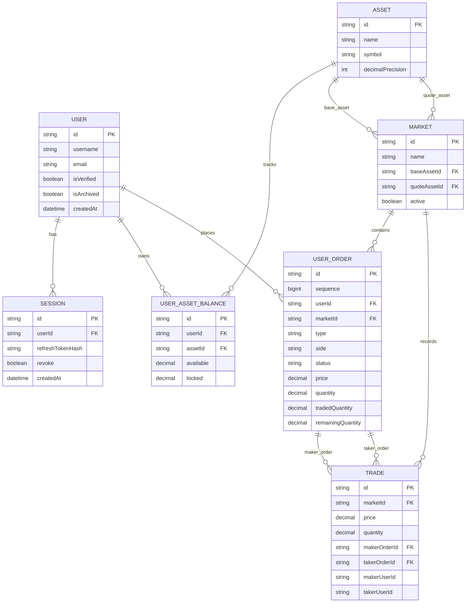

# Centralized Exchange

A TypeScript monorepo for building a centralized crypto exchange backend. The project is focused on the core exchange infrastructure: user and market APIs, an in-memory trading engine, order matching, balances, positions, transport between services, and future persistence and realtime delivery workers.

The current system is still under active development. The most complete part is the core trading engine, which supports spot and perpetual order processing, orderbook matching, balance locking, perp margin and position updates, and engine snapshots.

## What This Project Does

This repository is intended to become a modular centralized exchange stack.

At a high level it can:

- Accept API requests through an Express backend.
- Authenticate users and protect user/order routes.
- Route market, order, balance, and depth requests toward the trading engine.
- Process typed engine events through NATS request/reply.
- Maintain in-memory markets, assets, balances, orderbooks, orders, and positions.
- Match orders using price-time priority.
- Support spot and perpetual market order flows.
- Lock and unlock balances before and after matching.
- Apply fills to user balances or perp positions.
- Return engine-safe responses back to callers.
- Snapshot engine state to disk after successful mutating operations.
- Define database models for users, sessions, assets, markets, balances, orders, and trades.
- Provide Redis Streams helpers for a backend-to-engine request/response pipeline.

## Languages And Tools Used

- TypeScript: primary language across apps and packages.
- JavaScript/TSX: frontend and React/Next.js application code.
- SQL: Prisma migrations for PostgreSQL schema changes.
- Prisma: database schema and generated database client.
- Bun: package manager and workspace runtime tooling.
- Turbo: monorepo task runner.
- Node.js: server runtime target.
- Express: HTTP API backend.
- Next.js: frontend and docs application shells.
- NATS: active engine request/reply transport.
- Redis Streams: planned/scaffolded stream transport between backend, engine, and workers.
- PostgreSQL: persistent database.
- Docker Compose: local infrastructure for Postgres, Redis, and NATS.
- Zod: shared request validation schemas.
- Jest: backend test setup.
- functional-red-black-tree: orderbook price-level indexing.

## Repository Architecture

```txt
centralized-exchange/
  apps/
    core-backend/          HTTP API server for auth, users, markets, depth, and orders
    core-trading-engine/   In-memory matching, balances, positions, markets, and snapshots
    core-frontend/         Main Next.js frontend shell
    docs-frontend/         Documentation frontend shell
    database-engine/       Placeholder worker for writing engine events to the database
    ws-server/             Placeholder worker for pushing realtime data to clients

  packages/
    database/              Prisma schema, generated client, and database package exports
    redis-stream/          Redis Streams client, publisher, consumer, and group setup
    nats-stream/           NATS singleton manager, request/reply, publish, and subscribe helpers
    types/                 Shared TypeScript exchange, engine, Redis, and NATS types
    validations/           Shared Zod validation schemas
    ui/                    Shared React UI components and styles
    eslint-config/         Shared ESLint config
    typescript-config/     Shared TypeScript config
    jest-presets/          Shared Jest preset

  docker/
    docker-compose.dev.yml   Local Postgres, Redis, and NATS
    docker-compose.prod.yml  Production compose scaffold

  turbo.json
  package.json
  tsconfig.json
  bun.lock
```

## High-Level Architecture

The project is split into service apps and reusable workspace packages.

The API layer receives user-facing HTTP requests. The trading engine owns the critical exchange state and performs the matching and settlement logic. Shared packages keep event types, validation, transports, database code, and UI components consistent across apps.



## Main Services

### Core Backend

Path: `apps/core-backend`

The core backend is an Express API server. It is responsible for request parsing, auth middleware, route organization, validation, and sending exchange actions to the engine.

Current route groups:

- `/health`
- `/auth`
- `/user`
- `/market`
- `/depth`
- `/order`

The backend already has a `BackendResponseRouter` for Redis Streams request/response routing. That router creates a `requestId`, attaches a `backendId`, publishes a market event to Redis, listens to a backend-specific response stream, and resolves the original pending request.

### Core Trading Engine

Path: `apps/core-trading-engine`

The trading engine is the heart of the exchange. It is an in-memory engine that receives typed subjects, validates payloads, mutates state, settles fills, and returns typed responses.

The engine currently supports:

- Spot order processing.
- Perpetual order processing.
- Market and limit orders.
- GTC, IOC, and FOK behavior.
- Post-only checks.
- Self-trade prevention.
- Price-time priority matching.
- Balance locking and unlocking.
- Spot fill settlement.
- Perp margin locking and position updates.
- Market, order, depth, balance, and open-order queries.
- Snapshot save and restore.

The current runtime entry point subscribes to NATS subjects under `engine.>`:

```txt
NATS subject: engine.*
      |
      v
Engine.process(subject, payload)
```

There is also a commented Redis Streams path in the engine entry point. That path is intended to let the engine consume `market:event`, process each event through the same `Engine.process(...)` API, and publish results back to `backend:response:<backendId>`.

### Database Engine

Path: `apps/database-engine`

This is currently a placeholder worker. The intended role is to consume confirmed engine events or result streams and write durable records to PostgreSQL, such as:

- Orders.
- Trades.
- Balance updates.
- Market updates.
- User position snapshots.
- Engine audit logs.

### WebSocket Server

Path: `apps/ws-server`

This is currently a placeholder worker. The intended role is to push realtime exchange data to frontend clients, such as:

- Market depth updates.
- Trade ticks.
- Order status updates.
- User balance updates.
- User position updates.
- Liquidation alerts.

### Frontends

Paths: `apps/core-frontend`, `apps/docs-frontend`

Both are Next.js app shells using the shared `@workspace/ui` package. The core frontend is intended to become the exchange UI. The docs frontend is intended for project or API documentation.

## Trading Engine Internals

The engine owns one shared `EngineState` object. Sub-engines receive that state and operate on it.

```txt
EngineState
  balances    Map<UserId, Map<AssetId, Balance>>
  orderbooks  Map<MarketId, SingleMarketOrderBook>
  positions   Map<MarketId, Map<UserId, UserPosition>>
  markets     Map<MarketId, Market>
  orderMap    Map<OrderId, MarketId>
  orders      Map<OrderId, InMarketOrder>
  assets      Map<AssetId, Asset>
```

Important engine modules:

- `core-engine.ts`: orchestrates every engine request and owns `EngineState`.
- `oms-engine.ts`: validates order, market, user, orderbook, balance, and risk rules.
- `matching-engine.ts`: routes order actions to the correct market orderbook.
- `single-orderbook.ts`: matches orders for one market.
- `balance-engine.ts`: handles balances, locked funds, deposits, and spot settlement.
- `position-engine.ts`: handles perp positions, margin, realized PnL, and flips.
- `market-engine.ts`: initializes and manages markets and assets.
- `parse-incoming.ts`: converts JSON string amounts into `bigint` and normalizes responses back to strings.

## Data Flow

### Current NATS Flow



### Planned Redis Streams Flow



### Order Creation Flow



## Core Concepts Used

### Monorepo Workspaces

The repository uses Bun workspaces and Turbo. Apps and packages can import each other with workspace package names like `@workspace/types`, `@workspace/database`, `@workspace/redis-streams`, and `@workspace/nats-streams`.

### Event-Driven Engine Boundary

The trading engine is called through typed event subjects instead of direct HTTP handlers. This keeps exchange logic separated from the API layer and makes it possible to support multiple transports.

Current engine subjects include:

- `engine.order.create`
- `engine.order.cancel`
- `engine.order.openOrders`
- `engine.order.get`
- `engine.ramp.on`
- `engine.balance.get`
- `engine.depth.get`
- `engine.health.check`
- `engine.market.getAll`
- `engine.market.getAll.asset`
- `engine.market.get`
- `engine.market.add`
- `engine.market.update`
- `engine.market.delete`
- `engine.market.asset.add`
- `engine.user.add`

### In-Memory Matching

The engine keeps active exchange state in memory for speed. Each market has its own orderbook. Orders are matched by price-time priority, and the orderbook keeps price levels indexed so best bid/ask lookup is efficient.

### BigInt Accounting

The engine uses `bigint` for balances, prices, quantities, and margin calculations. Incoming JSON payloads use strings for numeric amounts, because JSON cannot safely represent large integers. Responses are normalized back to strings before leaving the engine.

### Balance Locking

Before matching, the engine locks the maximum funds an order may need.

For spot:

- Buy orders lock quote asset value.
- Sell orders lock base asset quantity.

For perps:

- Orders lock initial margin in the market quote asset.

After matching, fills are settled and unused locked balance is released.

### OMS And Risk Checks

The OMS layer performs validation before an order can enter matching. It checks market existence, order shape, time-in-force behavior, market constraints, leverage limits, liquidity, self-trade prevention, post-only behavior, and balance or margin availability.

### Snapshots

After successful mutating events, the engine saves a snapshot to disk. On startup, it attempts to restore from the snapshot. If no snapshot exists, it initializes default markets.

### Database Persistence

The Prisma schema defines durable records for users, sessions, assets, markets, balances, orders, and trades. The persistence worker still needs to be connected to the engine event/result pipeline.

## Local Development

Install dependencies:

```bash
bun install
```

Start local infrastructure:

```bash
docker compose -f docker/docker-compose.dev.yml up -d
```

Run all dev tasks through Turbo:

```bash
bun run dev
```

Run common workspace checks:

```bash
bun run build
bun run typecheck
bun run lint
```

Useful local services from `docker/docker-compose.dev.yml`:

- PostgreSQL: `localhost:5432`
- Redis: `localhost:6379`
- NATS: `localhost:4222`

## Environment Variables

The exact `.env` files still need to be standardized. Based on the current code, important variables include:

- `NATS_URL`: NATS server URL used by `@workspace/nats-streams`.
- `REDIS_HOST`: Redis host used by `@workspace/redis-streams`.
- `REDIS_PORT`: Redis port used by `@workspace/redis-streams`.
- `ENGINE_SNAPSHOT_PATH`: optional path for the trading engine snapshot file.
- Database connection variables for Prisma/PostgreSQL.
- Auth token secrets for the core backend.

## Current Status

Working or mostly implemented:

- Monorepo workspace structure.
- Shared TypeScript types.
- Shared validation package.
- Express backend skeleton and route modules.
- NATS transport helper.
- Redis Streams helper package.
- Core trading engine.
- Matching engine and orderbook logic.
- Balance and position engines.
- Market and asset engine state.
- Engine snapshots.
- Prisma database schema.
- Local Docker Compose infrastructure.

In progress or placeholder:

- Database engine worker.
- Test cases creation and debugg
- WebSocket server.
- Durable database writes from engine output.
- Frontend exchange screens.
- Docs frontend content.
- Redis Streams engine runtime path.
- Production deployment setup.

## What To Build Next

- Connect backend controllers fully to the active engine transport.
- Decide the primary transport path: NATS request/reply, Redis Streams, or both with clear responsibilities.
- Enable and test the Redis Streams engine consumer path.
- Build the database poller / database engine worker to persist orders, trades, balances, markets, and positions.
- Build the WebSocket server for realtime market and user updates.
- Add a liquidation engine for perpetual markets.
- Add mark price, index price, funding rate, and funding payment logic.
- Add risk engine checks for maintenance margin and liquidation price updates.
- Add trade history and candle/OHLCV aggregation.
- Add admin market-management APIs.
- Add idempotency keys for mutating requests.
- Add replay support from event logs into engine state.
- Add integration tests for order matching, settlement, snapshots, and transport routing.
- Add load tests for orderbook and engine throughput.
- Add observability: structured logs, metrics, tracing, and health checks.
- Add Dockerfiles and compose profiles for running the full exchange stack locally.
- Build the core frontend trading screen: markets, orderbook, chart area, order form, open orders, balances, and positions.

## Diagrams

These diagrams describe the intended system shape. Some pieces, like the database engine, WebSocket server, and Redis Streams runtime path, are scaffolded or planned rather than fully active.

### System Architecture

```mermaid


```

### Order Matching Flow



### Persistence Flow



### WebSocket Realtime Flow



### Database Model


