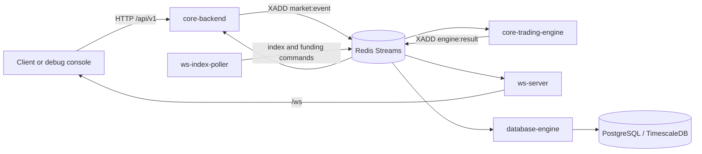

# CEX project documentation

This repository is a TypeScript monorepo for a centralized exchange. Its internal path accepts authenticated HTTP commands, serializes them through Redis Streams, mutates single-owner in-memory trading state, and distributes correlated results to persistence and realtime consumers.

The codebase is under active development. These docs deliberately distinguish implemented behavior from scaffolding and legacy paths.

> **Info:** Redis Streams is the active engine transport. The NATS package and rollback code remain in the repository, but the backend and trading-engine NATS calls are commented out.

## Start with the system map

## What is implemented

- JWT-based signup, signin, refresh, signout, and protected HTTP routes.
- Spot and perpetual limit/market orders with GTC, IOC, and FOK behavior.
- Price-time matching, balance or margin reservation, fill settlement, fees, self-trade prevention, and reduce-only checks.
- Index-price ingestion, funding calculations, liquidation discovery, and engine snapshots.
- Redis request correlation between the backend and the trading engine.
- PostgreSQL persistence for users, sessions, markets, assets, orders, trades, ticker data, asset transactions, funding, and liquidation records.
- Market-data WebSocket subscriptions for ticker, price, and depth events.
- A read-only-by-default proxy for Backpack Exchange public REST data.

## Documentation map

| Need | Read |
|---|---|
| Run the repository | [Local development](/docs/getting-started/local-development) |
| Find an app or package | [Repository map](/docs/getting-started/repository-map) |
| See every service | [Service catalog](/docs/architecture/services) |
| Understand the complete request path | [Integration flow](/docs/architecture/integration-flow) |
| Integrate over HTTP | [REST API](/docs/api/rest-api) |
| Consume realtime data | [WebSocket API](/docs/api/websocket-api) |
| Follow a perpetual order | [Perpetual order workflow](/docs/trading/perpetual-order-workflow) |
| Inspect persistent entities | [Database schema](/docs/data/database-schema) |
| Operate the stack safely | [Operations runbook](/docs/operations/runbook) |

## Source-of-truth policy

The Markdown in `packages/docs` is the docs site's content source. When behavior changes, update the relevant page alongside the code. Types in `packages/types`, Zod schemas in `packages/validations`, Express routers, the Prisma schema, and engine tests remain the executable sources of truth.

