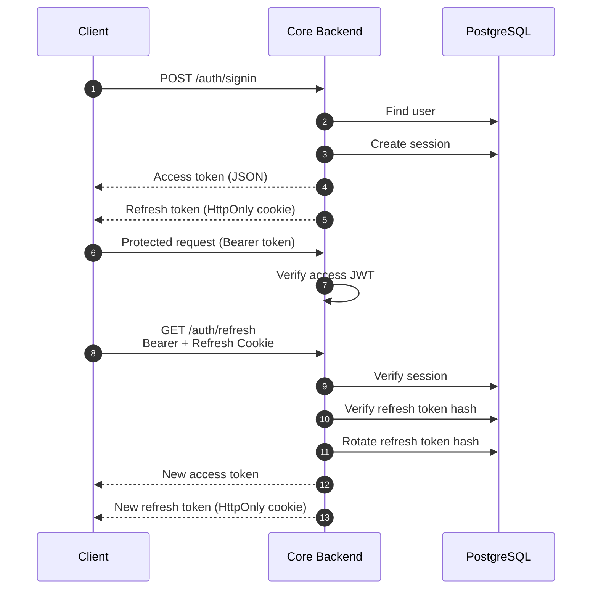

# Authentication and errors

## Session lifecycle



Access tokens expire after 15 minutes. Refresh tokens expire after seven days. Session records hold a bcrypt hash of the refresh token plus IP/user-agent metadata.

## Current authentication caveats

- `requireAuth` verifies JWT signature/claims but does not look up the session or check its `revoke` flag for every protected request.
- Refresh and signout routes are guarded by an access token in addition to requiring the refresh cookie.
- `requireAdminAuth` currently performs the same checks as `requireAuth`; there is no role authorization.
- Signup currently sets `isVerified: true`, bypassing a real verification flow.
- Signout-all, OTP, password recovery/change, archive, and profile update controllers are stubs.

## Validation error

Zod failures are returned with HTTP 400:

```json
{
  "success": false,
  "message": "Zod Validation failed",
  "type": "VALIDATION_ERROR",
  "errors": {
    "quantity": ["Only numbers and a single decimal point are allowed"]
  }
}
```

In development, the error middleware also includes a stack trace.

## Authentication error

Authentication failures generally use HTTP 403 and a specific `type`, such as:

- `TOKEN_UNAVAILABLE`;
- `USER_UNAVAILABLE`;
- `USER_DISABLED`;
- `USER_UNVERIFIED`;
- `UNAUTHORIZED_ACCESS`;
- `SESSION_UNAVAILABLE`;
- `TOKEN_INVALID`.

## Engine rejections

The engine returns a machine-readable rejection code internally. The backend currently converts most unsuccessful engine calls to a generic HTTP 400 `API_ERROR`, preserving the message but not always exposing the engine code at the top level.

Common codes include:

| Area | Codes |
|---|---|
| Input | `INVALID_MARKET`, `INVALID_SIDE`, `INVALID_ORDER_TYPE`, `INVALID_QUANTITY`, `INVALID_PRICE`, `INVALID_POSITION` |
| Market constraints | `BELOW_MIN_QTY`, `BELOW_MIN_NOTIONAL`, `INVALID_TICK_SIZE`, `INVALID_LOT_SIZE`, `LEVERAGE_EXCEEDED` |
| Funds/risk | `INSUFFICIENT_BALANCE`, `INSUFFICIENT_MARGIN`, `NO_LIQUIDITY` |
| Order policy | `MARKET_ORDER_GTC`, `POST_ONLY_WOULD_TRADE`, `REDUCE_ONLY_INVALID`, `MAX_OPEN_ORDERS` |
| Self-trade prevention | `STP_TRIGGERED` |
| Lifecycle | `ORDER_NOT_FOUND`, `MARKET_ALREADY_EXISTS`, `MARKET_NOT_EMPTY`, `USER_NOT_FOUND` |

## Client handling guidance

1. Branch on HTTP status and `type` for auth/validation failures.
2. Display the server `message` for engine rejections, but do not parse it as a stable API contract.
3. Treat network timeout as indeterminate for mutating requests because the engine may process a delayed stream entry.
4. Reconcile an order by ID or fetch open/historical orders after a timeout.

