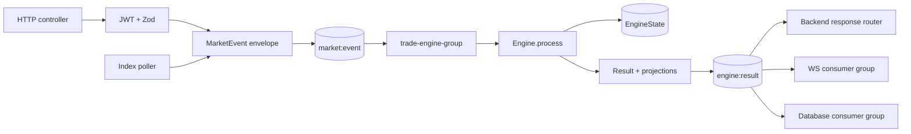
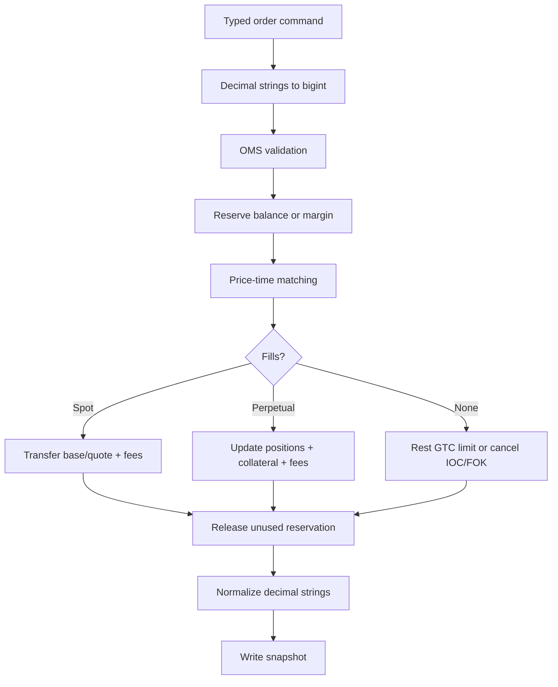
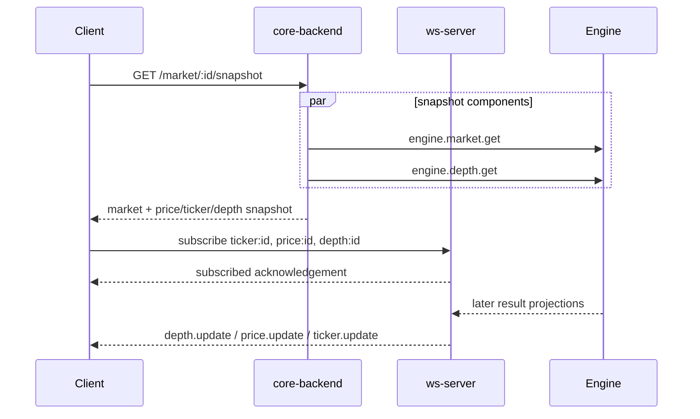
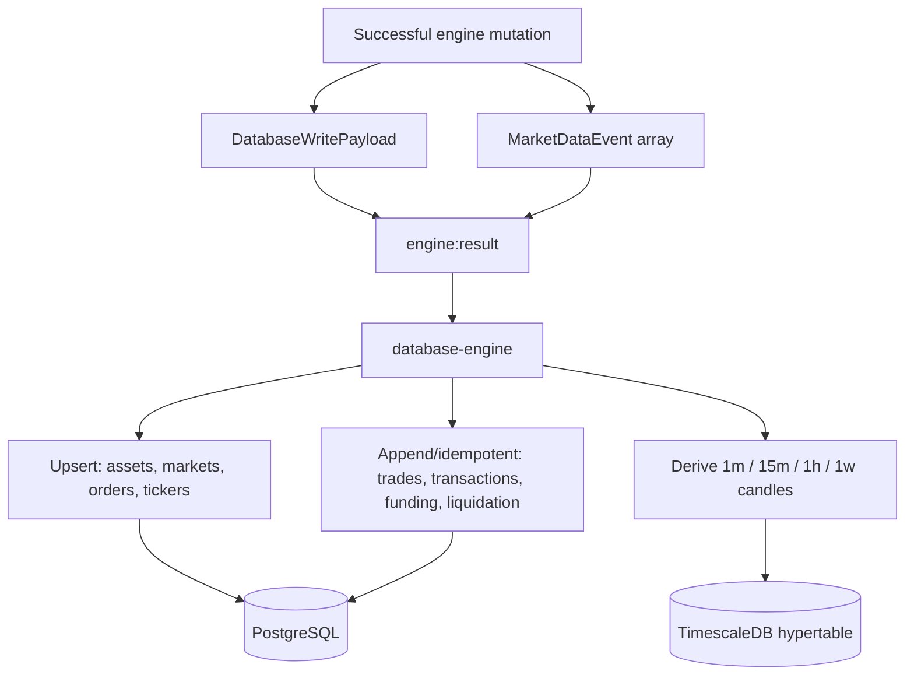
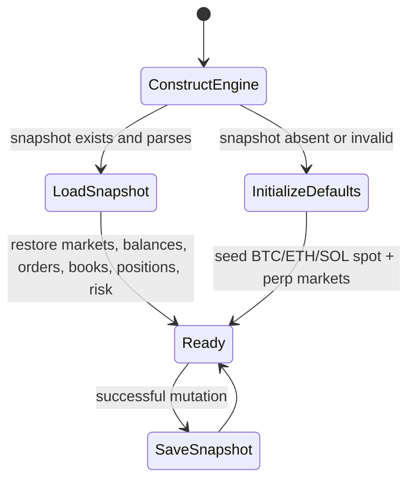

# Data flow and diagrams

## Command-to-result pipeline

## Engine mutation pipeline

## Realtime bootstrap and deltas

Clients should discard deltas older than the snapshot and use `seq` for depth ordering. Shared helpers in `packages/types/src/types/market-data.ts` implement the cursor comparisons.

## Durable data projection

## State recovery

The snapshot is a recovery point, not an append-only event log. PostgreSQL is also not used to reconstruct live books/positions in the current startup path.

