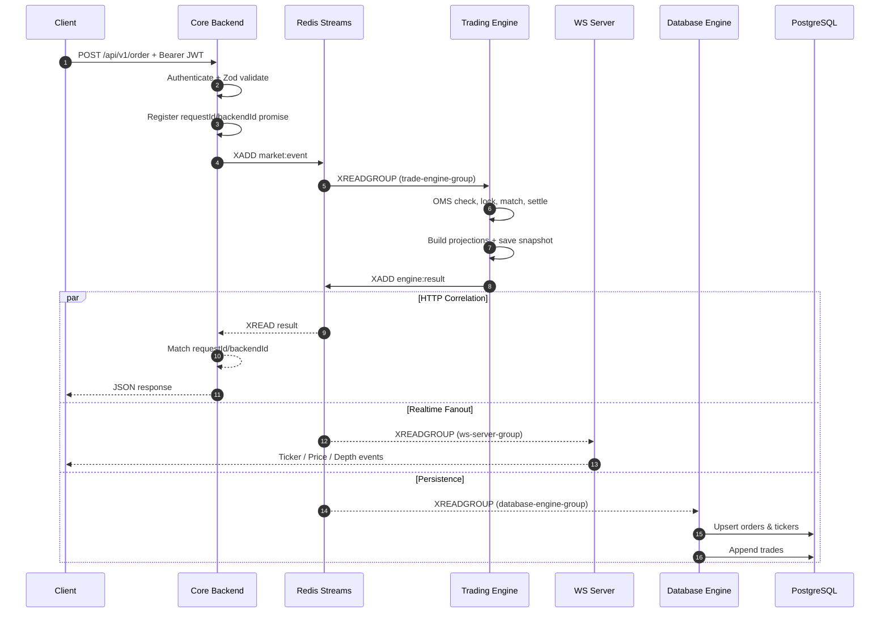
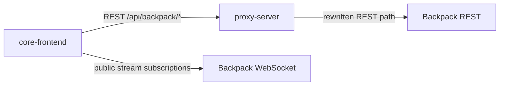
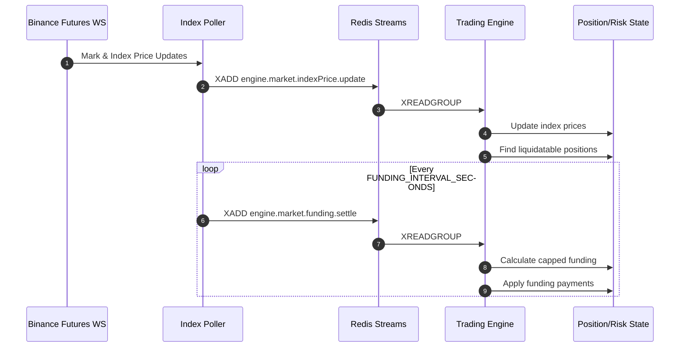

# Integration flow

There are two client-facing integration paths in the repository. Keeping them separate prevents an external market-data call from being mistaken for an internal exchange command.

## Path A: internal exchange command and realtime result



The database write is not on the HTTP critical path. An accepted order can be returned before its projection is committed to PostgreSQL.

## Path B: external market-data UI



The proxy protects the upstream with an origin allowlist, rate limiting, and a read-only default. The browser WebSocket client currently connects directly to Backpack and manages reconnect/subscription state locally.

## Index, funding, and liquidation path



The poller maps only BTC, ETH, and SOL perpetual symbols. Other external symbols are ignored.

## Where NATS fits

`@workspace/nats-streams` implements request/reply, publish, wildcard subscription, reconnection, and BigInt-safe JSON encoding. Backend controllers and the engine entry point retain commented NATS calls for rollback:

```text
core-backend -- request(engine.subject) --> NATS -- engine.> --> core-trading-engine
```

This is not executed in the current runtime. Redis Streams is the only active engine command transport, and running the NATS container does not make it part of the request path.

## Correlation envelope

A command on `market:event` carries:

```json
{
  "requestId": "correlation-id",
  "backendId": "backend-process-id",
  "source": "BACKEND",
  "type": "engine.order.create",
  "payload": {},
  "timestamp": 1782640000000
}
```

The result repeats `requestId`, `backendId`, and `sourceEventType`, then includes the typed engine payload and optional `updates.marketData` / `updates.database` projections.

## Failure boundaries

- HTTP validation failure: no Redis command is written.
- Backend timeout: the request promise rejects after five seconds; the engine may still process a delayed command.
- Engine rejection: a typed failure response is returned without a snapshot or downstream projections.
- WS delivery failure: does not roll back the engine mutation.
- Database failure: the batch is not acknowledged, but there is no automated pending-entry reclaim yet.
- Snapshot write failure: currently occurs inside the engine command path and can turn processing into an internal error after state mutation.

