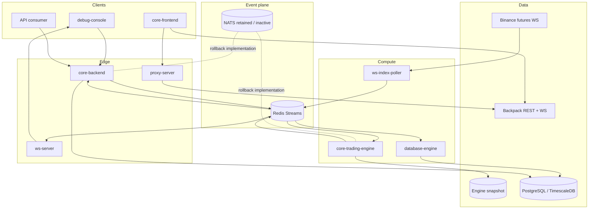

# System architecture

The internal exchange is event-driven around one active command stream and one result stream. The trading engine is the authoritative owner of live balances, positions, orders, and orderbooks; PostgreSQL holds durable projections rather than driving matching decisions.

## Runtime topology

## Ownership rules

| State | Active owner | Durable copy |
|---|---|---|
| Orderbooks and open orders | Trading engine | Snapshot; orders projected to PostgreSQL |
| User balances | Trading engine | Snapshot; asset transactions in PostgreSQL |
| Perpetual positions | Trading engine | Snapshot; no `Position` table by design |
| Markets and assets | Trading engine | Snapshot and PostgreSQL projection |
| Users and sessions | Core backend | PostgreSQL |
| Trades and candles | Database engine | PostgreSQL / TimescaleDB |
| WS subscriptions | Each WS server process | None |

## Consistency model

1. The backend registers a pending promise before adding a command to `market:event`.
2. The trade-engine consumer group gives a command to a trading-engine consumer.
3. The engine mutates in-memory state synchronously for that command.
4. On a successful mutation, the engine attaches realtime and database projections and writes a snapshot.
5. A backend-originated command is published to `engine:result`.
6. The backend resolves the matching request while the WS and database consumer groups independently process the same result.

This means the HTTP response and downstream projections share a correlation/result event, but PostgreSQL persistence happens asynchronously after engine acceptance.

## Current constraints

- Engine state is process-local; horizontal engine scaling requires market partitioning or another single-writer strategy that is not implemented here.
- Snapshot writes use a local file and are not a distributed journal.
- Redis consumers acknowledge only after their handlers succeed, but pending-entry recovery and dead-letter processing are not implemented.
- The backend result listener starts at `$`, so results produced before a backend process starts are not replayed to that process.
- WS subscription maps are local to a WS server instance.

