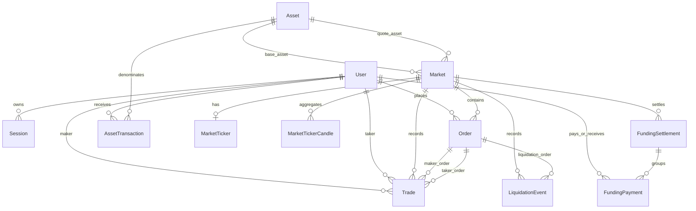

# Database schema

Prisma defines 12 models. Monetary values are stored as decimal strings to avoid floating-point loss and to match engine/API serialization. Engine-internal arithmetic uses scaled `bigint` values.

## Entity overview

## Identity and authentication

### User

`User` stores unique username/email, a bcrypt password hash, verification/archive flags, and timestamps. It relates to sessions and all user-owned durable exchange records.

### Session

`Session` stores the user, refresh-token hash, device IP/user agent, revocation state, and timestamps. The session ID is embedded in access and refresh JWTs.

## Market definition

### Asset

Assets have a unique symbol, integer precision, optional name/logo, and active flag. A single asset can be the base or quote of multiple markets.

### Market

Markets have a caller-defined ID and unique name, base/quote assets, `SPOT` or `PERP` type, leverage/quantity/tick/lot/notional constraints, and an active flag.

The tuple `(baseAssetId, quoteAssetId, marketType)` is unique.

## Orders and trades

### Order

The durable order projection includes:

- unique ID and autoincrement sequence;
- user, market, market type;
- type, side, optional position direction, status;
- entry/average price and quantity progress;
- post-only, reduce-only, liquidation, leverage, margin;
- STP and time-in-force policy;
- creation, update, cancel, and fill timestamps.

Indexes support market, user, user+market, status+market, and creation-time queries.

### Trade

Each trade records engine trade ID, market, price, quantity, aggressor/maker side data, fill status, maker/taker orders and users, fees, and creation time.

`(marketId, engineTradeId)` is unique, allowing engine trade IDs to restart per market.

## Market data

### MarketTicker

One row per market stores last price, 24-hour change/high/low/volume, last trade ID, and update time. The database engine only applies a ticker with a newer trade ID.

### MarketTickerCandle

The composite primary key is `(marketId, interval, bucketStart)`. Candles store OHLC, base/quote volume, trade count, last trade ID, and timestamps.

The latest migration enables TimescaleDB and converts this table to a hypertable partitioned by `bucketStart`.

## Ledger-like records

### AssetTransaction

Records on-ramp/deposit/withdrawal/adjustment intent and status, with optional external reference and reason. Current engine projections create applied on-ramp and withdrawal records.

### FundingSettlement and FundingPayment

A settlement stores market prices, interval, funding rate, insurance use, count, and settlement time. Individual payment rows link to a user, market, runtime position ID, and optional settlement.

### LiquidationEvent

Records the liquidated user, optional liquidator and liquidation order, index price, quantity, bankruptcy/liquidation prices, insurance use, and timestamp.

## Intentional omissions

There is no database `Balance`, `Position`, or orderbook-level table. Comments in the Prisma schema explicitly classify these as runtime trading-engine state.

Consequences:

- balances and positions recover from the engine snapshot, not PostgreSQL;
- `AssetTransaction` is an audit/projection record, not the live balance source;
- order rows are durable projections, not the matching engine's input state;
- a lost/corrupt snapshot cannot currently be rebuilt completely from these tables.

## Enum alignment

Prisma and TypeScript enums mostly share names. `TimeInForce` differs at the wire/type layer: TypeScript values are `Good_Till_Cancel`, `Immediate_OR_Return`, and `Fill_OR_KILL`, while Prisma stores `GTC`, `IOC`, and `FOK`. The database engine performs the mapping.
