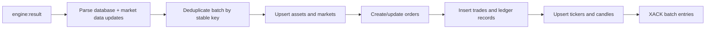

# Persistence and snapshots

The repository uses two persistence mechanisms with different jobs:

- a synchronous local snapshot for live engine recovery;
- asynchronous PostgreSQL projections for queries and audit/history.

## Projection creation

At the start of every engine command, `DatabaseManager` clears its pending bucket. Successful mutations capture relevant records:

| Mutation | Captured data |
|---|---|
| Order create/cancel/fill | Assets, market, touched orders, trades |
| On-ramp/withdraw | Asset transaction |
| Market/asset changes | Market and asset records |
| Funding | Settlement and individual payments |
| Liquidation | Liquidation event |

Only non-empty database buckets are attached to the engine result.

## Database consumer

Assets are create-many then updated. Markets use upsert. Orders are create-many then updated. Trades and ledger-like rows use `createMany(... skipDuplicates)`. Tickers and candles use SQL conflict handlers guarded by monotonically increasing engine trade IDs.

The database engine acknowledges the messages only after `persistDatabaseEvents` completes. A parse-invalid message is logged and acknowledged so it does not poison the group indefinitely.

## Candle construction

Each ticker trade event becomes records for `1m`, `15m`, `1h`, and `1w` buckets. Weekly buckets start Monday at 00:00 UTC. Conflict updates preserve high/low, replace close, add volume/trade count, and advance last trade ID.

## Snapshot contents

The JSON snapshot contains:

- event sequence ID;
- balances and locked balances;
- markets/assets;
- open/live orders and enough data to rebuild books;
- positions;
- index/funding risk state;
- insurance and commission funds;
- funding payment history.

BigInts are serialized as decimal strings. The default path is `snapshots/core-engine.snapshot.txt` relative to the trading engine's working directory and can be overridden with `ENGINE_SNAPSHOT_PATH`.

## Startup restore

If the snapshot exists, the engine:

1. parses markets, assets, risk/fund state, balances, positions, and orders;
2. recreates an empty orderbook and position manager for every market;
3. restores positions and their liquidation indexes;
4. filters orders to live `OPEN`/`PARTIAL_FILLED` records with remaining quantity;
5. sorts those orders by creation time and rests them to rebuild price-time order.

Without a snapshot, it seeds BTC/ETH/SOL against INR and USD plus BTC/ETH/SOL perpetual markets.

## Guarantee boundaries

- Snapshot writes are synchronous but not atomic temp-file + rename writes.
- There is no checksum, version field, or corruption fallback around JSON parsing.
- PostgreSQL writes are asynchronous and may lag a successful HTTP result.
- No outbox transaction links snapshot mutation and result publication.
- Redis pending-entry recovery, retention, and dead-letter policies are absent.
- PostgreSQL cannot fully reconstruct balances, positions, and book priority by itself.

For production, add snapshot versioning/atomic replacement, durable command journaling, consumer recovery, retention, and reconciliation metrics before relying on crash recovery guarantees.

