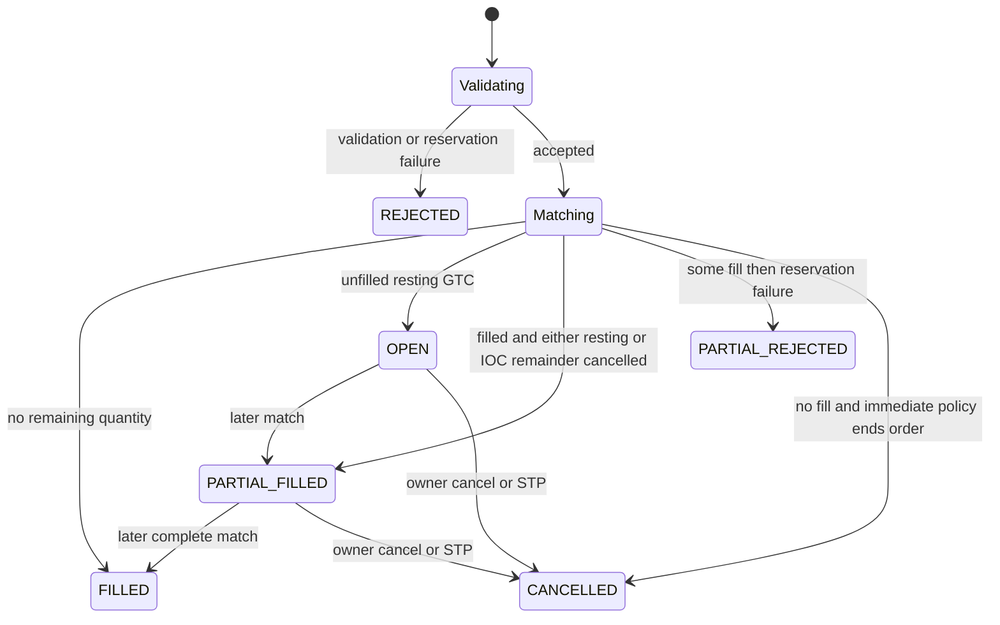
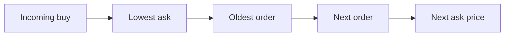

# Order lifecycle and matching

## Supported order types

The engine supports `LIMIT` and `MARKET` orders for spot and perpetual markets. Stop, stop-limit, iceberg, and trailing orders are not implemented.

| Order | Allowed TIF | Can rest? |
|---|---|---|
| Limit | GTC, IOC, FOK | Only GTC |
| Market | IOC, FOK | No |
| Post-only limit | Normally GTC | Yes, rejected if immediately marketable |
| Reduce-only perpetual | IOC/FOK for limits under current rules | No |

## Status state machine

PostgreSQL uses the same status names. The live engine's global `orders` map retains only live/resting orders after snapshot restore; historical lookups belong to PostgreSQL.

## Price-time priority

The orderbook finds the best opposing price through a red-black tree and processes the linked list at that price from head to tail. The fill price is the maker price.

## Time in force

### GTC

An unfilled limit remainder is inserted into its side of the book. Its balance or margin reservation remains locked until fills or cancellation.

### IOC

The engine matches immediately and does not rest the remainder. A partially filled IOC has `PARTIAL_FILLED`; a zero-fill IOC has `CANCELLED`.

### FOK

Before matching, the engine scans price-compatible liquidity excluding the user's own orders. If the full quantity is unavailable, the order is cancelled without a fill.

## Self-trade prevention

When an incoming order reaches the same user's maker order:

| Mode | Behavior |
|---|---|
| `CANCEL_TAKER` | Stop and cancel incoming order |
| `CANCEL_MAKER` | Remove/release the resting maker, then continue matching |
| `CANCEL_BOTH` | Remove maker and cancel taker |

The OMS also rejects some crossing limit orders before matching for cancel-taker/cancel-both modes. Market orders defer STP behavior to the book.

## Spot settlement

- Buy: debit locked quote notional + fee; credit base quantity.
- Sell: debit locked base quantity; credit quote notional - fee.
- Maker and taker fees are added to the market commission fund.

## Perpetual settlement

Perpetual fills mutate positions rather than transferring base assets. Quote collateral is reserved for margin, positions are opened/increased/reduced/flipped, realized PnL changes quote total, and fees are charged separately.

## Query boundaries

- `/order/open/:marketId` and `/order/:orderId` query live engine state.
- `/order/all/:marketId` queries persisted order projections.
- Filled and cancelled orders are removed from the live book and may no longer be available through the live order-by-ID route.

