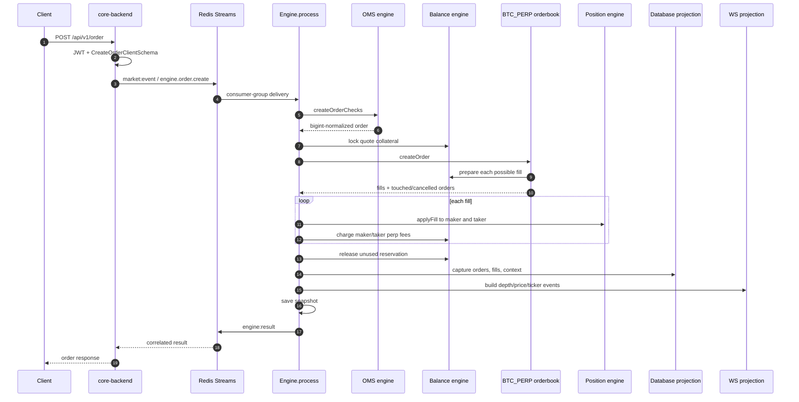

# Perpetual order workflow

This page follows a `BTC_PERP` opening limit order through every implemented boundary.

## Example command

```json
{
  "marketId": "BTC_PERP",
  "marketType": "PERP",
  "entryPrice": "65000.00",
  "quantity": "0.10",
  "leverage": 10,
  "side": "BUY",
  "position": "LONG",
  "type": "LIMIT",
  "postOnly": false,
  "reduceOnly": false,
  "stpMode": "CANCEL_TAKER",
  "timeInForce": "Good_Till_Cancel"
}
```

## End-to-end sequence



## 1. HTTP and transport validation

The backend authenticates the Bearer JWT and validates the body with Zod. It injects `userId` and `createdAt`, then publishes `engine.order.create` with `requestId`, `backendId`, and source `BACKEND`.

The backend registers the response promise before publishing, avoiding a fast-response race.

## 2. Decimal normalization

The engine finds the market and converts human decimal strings to scaled `bigint` values using each asset's precision. Engine arithmetic stays integer-based; responses are converted back to strings.

## 3. OMS checks

The order passes these gates before money is locked:

1. Market and user exist.
2. Side and type are supported.
3. Quantity and entry price are positive.
4. Perpetual direction is coherent: `LONG -> BUY`, `SHORT -> SELL`.
5. Leverage is positive and no greater than `market.maxLeverage`.
6. Quantity meets `minQty` and the lot-size grid.
7. Price meets the tick-size grid and minimum notional.
8. Market orders do not use GTC.
9. Reduce-only rules do not increase or over-close exposure.
10. The user has fewer than 100 open orders in the market.
11. Post-only and self-trade rules pass.
12. Required quote collateral exists; market orders have enough opposing liquidity.

## 4. Margin reservation

For a normal perpetual limit order, the balance engine calculates initial margin from quantity, entry price, leverage, and market precision, then increments `locked` on the quote-asset balance.

```text
notional = quantity × entry price
initial margin ~= notional / leverage
```

Market orders use a buffered reservation. Reduce-only orders reserve zero new margin. The normalized in-market order stores its reserved margin.

If a later stage rejects before completion, the engine attempts to release the initial lock.

## 5. Matching

Each market has a `SingleMarketOrderBook` with:

- red-black trees for ordered bid/ask price lookup;
- a FIFO doubly linked list at each price level;
- global and per-user order maps.

A buy taker walks asks from the lowest price; a sell taker walks bids from the highest. Fills execute at the maker's resting price. Within a price level, orders execute in insertion order.

Before each perpetual fill, the balance engine determines how much of the requested quantity both parties can actually collateralize and allots fill margin. This can produce a partial rejection if reservations cannot support the full requested fill.

## 6. Time-in-force outcome

| Condition | Outcome |
|---|---|
| Fully matched | `FILLED` |
| GTC limit with remainder | Rest as `OPEN` or `PARTIAL_FILLED` |
| IOC/market with remainder | Remainder cancelled; status may remain `PARTIAL_FILLED` |
| FOK lacks executable quantity | `CANCELLED` before matching |
| Reservation limits fill | `REJECTED` or `PARTIAL_REJECTED` |

## 7. Position mutation

Every fill is applied to maker and taker positions:

- no current position: create a position;
- same direction: increase quantity and calculate weighted average price;
- opposite direction, smaller fill: partially close and realize PnL;
- equal opposite fill: close the position;
- larger opposite fill: close, realize PnL, then flip the remainder.

The engine recalculates effective leverage, bankruptcy price, and liquidation price, and updates the appropriate liquidation-price index.

## 8. Fees and unused margin

Maker and taker quote fees are charged from available quote balance and accumulated in the market commission fund. Any reservation not needed by fills is released unless the order is a resting GTC limit order, in which case the required reservation remains locked.

## 9. Projections and response

The engine captures all touched orders and fills for persistence. It builds:

- depth updates for changed levels;
- a price and ticker update for each trade fill;
- database records for market context, orders, and trades.

It saves the snapshot, publishes the correlated result, and the backend responds. The database engine and WS server consume the same result independently.

## Cancellation

Cancellation verifies ownership, removes the order node and empty price level, releases the remaining margin reservation, captures an updated order record, emits a depth delta, saves a snapshot, and returns a correlated result.

