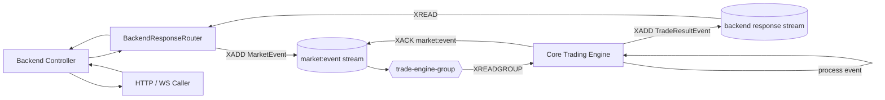
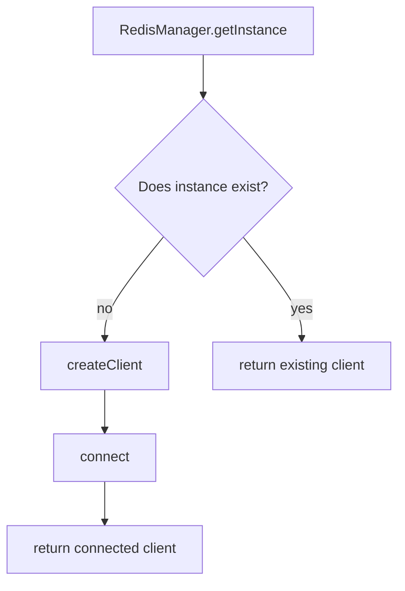
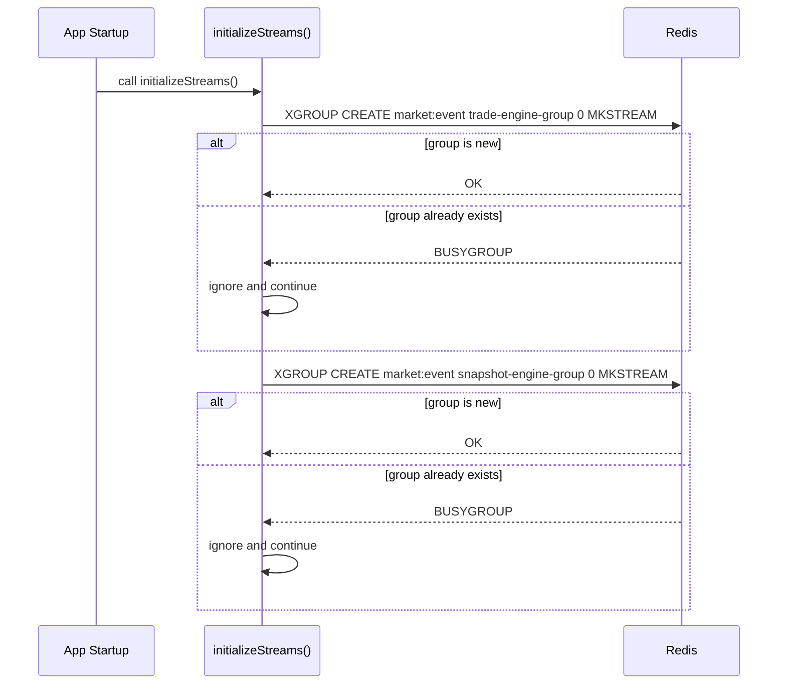
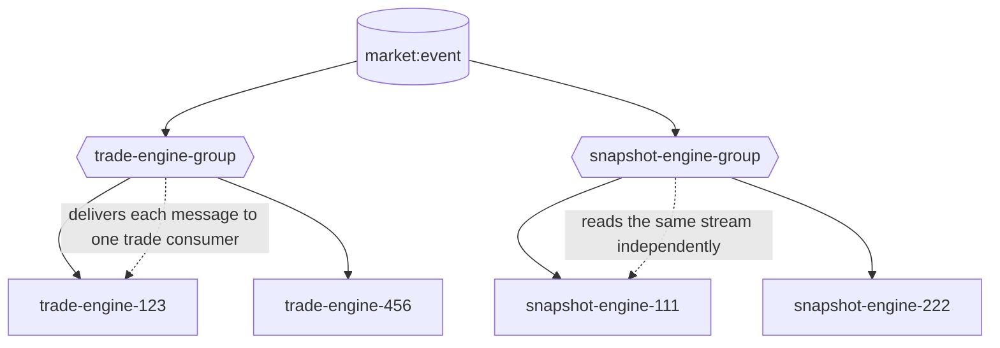
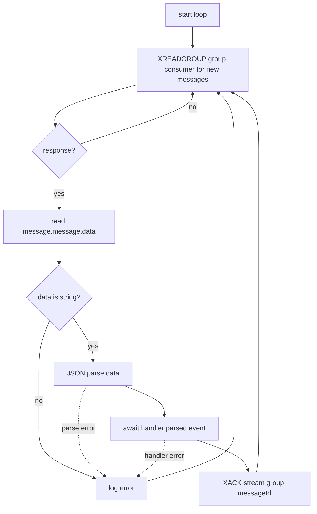
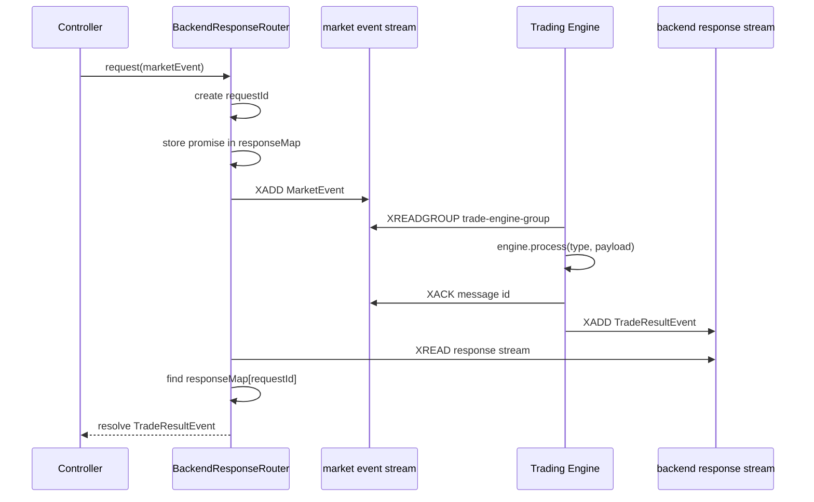

# Redis Streams Package

This package is published inside the workspace as `@workspace/redis-streams`.
The folder is named `packages/redis-stream`, but the package name used by other
apps is plural.

It provides the Redis Stream transport layer for moving requests from the
backend to the trading engine and sending engine results back to the correct
backend instance.

## What Redis Streams Give Us

Redis Streams are append-only logs stored inside Redis. A producer appends a
message with `XADD`, and consumers read messages by stream entry id.

Each message has:

- A stream key, such as `market:event`
- A Redis-generated id, such as `1710000000000-0`
- A field map, such as `{ data: "<json>" }`

In this project every payload is stored in the `data` field as JSON.

```txt
market:event
  1710000000000-0  data="{ requestId, backendId, type, payload, timestamp }"
  1710000000100-0  data="{ requestId, backendId, type, payload, timestamp }"
  1710000000200-0  data="{ requestId, backendId, type, payload, timestamp }"
```

## Streams Used In This Project

The stream names are defined in `packages/types/src/types/redis-types.ts`.

| Constant | Redis key | Purpose |
| --- | --- | --- |
| `REDIS_STREAMS.MARKET_EVENT` | `market:event` | Shared input stream for engine-facing market requests. |
| `REDIS_STREAMS.backendResponse(backendId)` | `backend:response:<backendId>` | Dedicated response stream for one backend process. |

The consumer groups are:

| Constant | Group name | Reads from | Purpose |
| --- | --- | --- | --- |
| `CONSUMER_GROUPS.TRADE_ENGINE` | `trade-engine-group` | `market:event` | Trading engine workers process backend market events. |
| `CONSUMER_GROUPS.SNAPSHOT_ENGINE` | `snapshot-engine-group` | `market:event` | Snapshot workers can independently observe the same events. |

Consumer names are process-specific:

```ts
`${CONSUMERS.TRADE_ENGINE}-${process.pid}`
```

That makes each running engine process a distinct consumer inside the same
consumer group.

## High-Level Flow



Step by step:

1. A backend controller receives a request.
2. `BackendResponseRouter.request(...)` creates a `requestId` and attaches this backend process's `backendId`.
3. `RedisPublisher.publishMarketEvent(...)` appends the event to `market:event` using `XADD`.
4. A trading engine consumer reads the event from `market:event` using `XREADGROUP`.
5. The engine calls the normal `engine.process(event.type, event.payload)` method.
6. If the handler succeeds, the consumer acknowledges the message with `XACK`.
7. The engine publishes a `TradeResultEvent` to `backend:response:<backendId>`.
8. The backend response router reads its own response stream with `XREAD`.
9. The router matches the returned `requestId` to the pending promise and resolves the controller response.

## Package Files

```txt
packages/redis-stream/src
  client.ts      Redis singleton connection
  streams.ts     stream and consumer-group initialization
  publisher.ts   XADD helpers for request and response events
  consumer.ts    generic XREADGROUP consumer loop
  index.ts       package exports
```

## Redis Client Lifecycle

`RedisManager` in `client.ts` creates one Redis client per process.



The connection uses:

```ts
createClient({
  socket: {
    host: process.env.REDIS_HOST,
    port: Number(process.env.REDIS_PORT),
  },
});
```

Every publisher, consumer, and initializer calls:

```ts
const redis = await RedisManager.getInstance();
```

This avoids opening a new Redis connection for every message.

## Stream And Group Creation

`initializeStreams()` in `streams.ts` creates the consumer groups that read
from `market:event`.

```ts
await createGroup(REDIS_STREAMS.MARKET_EVENT, CONSUMER_GROUPS.TRADE_ENGINE);
await createGroup(REDIS_STREAMS.MARKET_EVENT, CONSUMER_GROUPS.SNAPSHOT_ENGINE);
```

Internally, `createGroup(...)` calls:

```ts
redis.xGroupCreate(stream, group, "0", { MKSTREAM: true });
```

Important details:

- `stream` is the Redis stream key.
- `group` is the consumer group name.
- `"0"` means the group starts from the beginning of the stream.
- `MKSTREAM: true` creates the stream automatically if it does not exist.
- `BUSYGROUP` is ignored because it means the group already exists.



The Redis path in `apps/core-trading-engine/src/index.ts` is currently present
but commented out. When Redis Streams are used for the engine, startup should
initialize the groups before starting consumers:

```ts
await initializeStreams();
```

## Publishing Events

`RedisPublisher` has two publishing methods.

### `publishMarketEvent(event)`

Used by the backend to send a request into the engine input stream.

```ts
redis.xAdd(REDIS_STREAMS.MARKET_EVENT, "*", {
  data: JSON.stringify(event),
});
```

The `*` tells Redis to generate the stream entry id.

The event shape is:

```ts
interface MarketEvent {
  requestId: string;
  backendId: string;
  source: EventSource;
  type: IncomingEventTypes;
  payload: PayloadToEngineType;
  timestamp: number;
}
```

### `publishTradeResult(event)`

Used by the trading engine to send the result back to the backend instance that
created the request.

```ts
redis.xAdd(REDIS_STREAMS.backendResponse(event.backendId), "*", {
  data: JSON.stringify(event),
});
```

The event shape is:

```ts
interface TradeResultEvent {
  requestId: string;
  backendId: string;
  success: boolean;
  payload: Record<string, any>;
  timestamp: number;
}
```

## Consumer Groups Explained

A normal Redis Stream consumer reads entries directly from a stream. A consumer
group adds coordination between multiple consumers.

Think of a consumer group as a named view over a stream:

- Each group has its own read position.
- Multiple groups can read the same stream independently.
- Inside one group, each message is delivered to only one consumer.
- A message stays pending in the group until a consumer acknowledges it.
- `XACK` marks a message as completed for that group.

This is why `trade-engine-group` and `snapshot-engine-group` can both read
`market:event` without stealing messages from each other.



Example:

```txt
market:event has messages: A, B, C

trade-engine-group:
  trade-engine-1 gets A
  trade-engine-2 gets B
  trade-engine-1 gets C

snapshot-engine-group:
  snapshot-engine-1 gets A
  snapshot-engine-1 gets B
  snapshot-engine-2 gets C
```

The same message can be processed once by the trade group and once by the
snapshot group, because groups are independent. But inside `trade-engine-group`,
only one trade-engine consumer receives a given message.

## Consumer Loop In This Package

`RedisConsumer<T>` is a generic consumer for one stream and one group.

```ts
const consumer = new RedisConsumer<MarketEvent>({
  stream: REDIS_STREAMS.MARKET_EVENT,
  group: CONSUMER_GROUPS.TRADE_ENGINE,
  consumer: `${CONSUMERS.TRADE_ENGINE}-${process.pid}`,
  handler: async (event) => {
    // process event
  },
});

await consumer.start();
```

The loop calls `XREADGROUP` like this:

```ts
redis.xReadGroup(
  group,
  consumer,
  [{ key: stream, id: ">" }],
  {
    BLOCK: blockTime || 100,
    COUNT: batchSize || 1,
  }
);
```

Meaning:

- `group` is the consumer group name.
- `consumer` is the unique consumer name in that group.
- `id: ">"` asks Redis for messages that have never been delivered to any consumer in this group.
- `BLOCK` waits for new messages instead of busy-spinning.
- `COUNT` controls the max number of messages returned per read.

After reading:

1. The consumer pulls `message.message.data`.
2. It requires `data` to be a string.
3. It parses the JSON into `T`.
4. It calls `options.handler(parsed)`.
5. If the handler resolves, it calls `XACK`.



## Pending Messages And Acknowledgement

When a consumer receives a message through `XREADGROUP`, Redis marks it as
pending for that consumer. The message is not considered finished until the
consumer sends:

```ts
redis.xAck(stream, group, message.id);
```

In this package, `XACK` happens only after `handler(parsed)` completes
successfully.

That gives at-least-once processing semantics:

- A message should not be acknowledged before engine processing finishes.
- If processing fails, the message remains pending.
- Redis still has the stream entry.
- A later recovery process could inspect and reclaim pending messages.

Current limitation: this consumer only reads new messages with `id: ">"`. It
does not currently reclaim old pending messages with `XAUTOCLAIM` or `XCLAIM`.
If a consumer crashes after receiving a message but before `XACK`, that message
can remain in the group's pending entries list until recovery logic is added.

## Backend Response Routing

The backend uses `BackendResponseRouter` in
`apps/core-backend/src/utils/backendResponseRouter.ts`.

Each backend process gets a unique id:


```ts
this.backendId = `backend-${cuid()}`;
```

When a request is sent:

1. The router creates a `requestId`.
2. It stores a pending promise in `responseMap`.
3. It publishes the enriched `MarketEvent` to `market:event`.
4. It waits for a matching `TradeResultEvent`.

The response listener reads:

```ts
REDIS_STREAMS.backendResponse(this.backendId)
```

using `XREAD`, not `XREADGROUP`.

That is intentional for the current design: each backend process has its own
private response stream, so the response router does not need competing
consumers. It only needs to read messages for itself and match by `requestId`.



## Current Engine Integration

The core trading engine currently starts with NATS enabled:

```ts
await nats.subscribe("engine.>", engine.process);
```

The Redis Streams engine path exists below it but is commented out. The intended
Redis version is:

```ts
await initializeStreams();

const consumer = new RedisConsumer<MarketEvent>({
  stream: REDIS_STREAMS.MARKET_EVENT,
  group: CONSUMER_GROUPS.TRADE_ENGINE,
  consumer: `${CONSUMERS.TRADE_ENGINE}-${process.pid}`,
  handler: async (event: MarketEvent) => {
    const resultPayload = await engine.process(event.type, event.payload);

    await RedisPublisher.publishTradeResult({
      requestId: event.requestId,
      backendId: event.backendId,
      success: resultPayload.success,
      payload: resultPayload,
      timestamp: Date.now(),
    });
  },
});

await consumer.start();
```

## Delivery Model

This implementation is designed for command-style engine requests:

- Backend publishes request events to `market:event`.
- Engine workers consume through `trade-engine-group`.
- Each request is processed by one engine consumer in that group.
- The response is sent to one backend-specific response stream.
- The backend matches responses with `requestId`.

Redis Streams gives durable queue-like behavior for the engine input stream, but
the current response streams are simple per-backend streams. If a backend
process restarts, it gets a new `backendId`, so responses sent to the old
backend stream will not be picked up by the new process.

## Useful Redis CLI Commands

Inspect stream messages:

```bash
redis-cli XRANGE market:event - +
```

Inspect groups on the market stream:

```bash
redis-cli XINFO GROUPS market:event
```

Inspect consumers in the trade engine group:

```bash
redis-cli XINFO CONSUMERS market:event trade-engine-group
```

Inspect pending messages:

```bash
redis-cli XPENDING market:event trade-engine-group
```

Read a backend response stream:

```bash
redis-cli XRANGE backend:response:<backendId> - +
```

## Operational Notes

- Set `REDIS_HOST` and `REDIS_PORT` before starting apps that use this package.
- Call `initializeStreams()` before starting group consumers.
- Use unique consumer names per process.
- Keep handlers idempotent where possible, because Redis Stream consumer groups are at-least-once.
- Add pending-message recovery with `XAUTOCLAIM` or `XCLAIM` before relying on automatic crash recovery.
- Consider stream trimming with `XTRIM` or `MAXLEN` if streams can grow forever in production.
